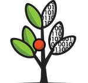

# Marwa Rouah - Data Science & AI Portfolio

Data Science & AI Student | Machine Learning Enthusiast | Analytics Professional

## About Me

Highly motivated and analytical individual pursuing a Bachelor's in Data Science & Artificial Intelligence at Breda University of Applied Sciences. Passionate about applying machine learning, data modeling, and visualization to solve real-world problems and drive data-driven decision-making.

## Education

- **Breda University of Applied Sciences**  
  Bachelor of Science - Data Science & Artificial Intelligence  
  *August 2022 - April 2026*

- **American Academy Casablanca**  
  High School Diploma - Graduated Magna Cum Laude  
  *September 2018 - August 2022*

## Work Experience

**Sales Associate @ Blokker** *(November 2023 - October 2024)*
- Performed diverse tasks including cashier duties, assisting customers, managing stock, handling deliveries, and maintaining a well-organized store

**Tutor @ Studentsplus** *(September 2023 - June 2024)*
- Tutored elementary and high school students in various subjects, helping improve academic performance

## Featured Projects

### [Plant Phenotyping & Automated Analysis System](https://github.com/BredaUniversityADSAI/2023-24b-fai2-adsai-Marwarouah223256)
**Technologies:** Python, Deep Learning, Computer Vision, Robotics, Azure, MLOps, OpenCV, PyBullet, Stable Baselines 3  
**Year:** 2024

Developed a comprehensive automated plant phenotyping system combining advanced computer vision techniques with robotic automation for agricultural research applications. This multi-phase project integrated traditional CV methods, deep learning models, and reinforcement learning for automated plant analysis and measurement.

**Computer Vision Pipeline:**
- **Image Annotation & Segmentation:** Created pixel-level annotations for 4 plant organ classes (root, shoot, seed, occluded_root) and developed deep learning models achieving >0.5 IoU on test sets
- **Traditional CV Methods:** Implemented ROI extraction algorithms for Petri dish detection with ±15 pixel accuracy using classical computer vision techniques
- **Instance & Semantic Segmentation:** Built both traditional CV and deep learning approaches for plant organ segmentation and individual plant identification
- **Landmark Detection:** Developed algorithms to detect critical plant landmarks including primary root tips, root-hypocotyl junctions, and lateral root tips with <100 pixel mean absolute error
- **Morphometric Analysis:** Created automated measurement systems for primary and lateral root lengths achieving <20% sMAPE for primary roots and <50% sMAPE for lateral roots

**Robotics & Automation:**
- **Simulation Environment:** Developed PyBullet-based simulation for Opentrons OT-2 robot with complete working envelope mapping
- **Reinforcement Learning Controller:** Implemented RL algorithms using Stable Baselines 3 with custom Gymnasium wrapper, achieving <10mm positioning accuracy
- **PID Controller:** Designed and tuned multi-axis PID controllers for precise robotic positioning with <1mm accuracy requirements
- **Integration Pipeline:** Combined computer vision algorithms with robotic controllers for automated plant handling and analysis

**Kaggle Competition Performance:**
- Participated in plant phenotyping competition predicting primary root lengths across 55 plants
- Developed end-to-end pipeline from raw image processing to landmark detection and morphometric measurements
- Achieved competitive ranking through systematic hyperparameter optimization and model ensemble techniques

**Technical Achievements:**
- **MLOps Implementation:** Established comprehensive CI/CD pipelines with automated model training, validation, and deployment
- **Cloud Infrastructure:** Deployed scalable Azure-based system with containerized applications and real-time monitoring
- **Multi-Modal Integration:** Successfully combined computer vision, robotics, and machine learning for agricultural automation
- **Performance Optimization:** Conducted extensive hyperparameter searches using Weights & Biases for experiment tracking and optimization

[View Project Repository](https://github.com/BredaUniversityADSAI/2023-24b-fai2-adsai-Marwarouah223256)

### Plant Phenotyping & Organ Segmentation System
**Technologies:** Python, Azure, CLI, API, MLOps, Git, Docker  
**Year:** 2024

Developed a comprehensive cloud-based application for automated plant organ segmentation and landmark detection, designed to revolutionize agricultural research and crop analysis.

**Key Achievements:**
- **Modular Architecture:** Built a scalable Python package with modular design, enabling easy integration and maintenance
- **Multi-Access Interface:** Created versatile access points including Command Line Interface (CLI), RESTful API, and intuitive web interface
- **Cloud Infrastructure:** Implemented robust Azure-based deployment with automated training pipelines and real-time model monitoring
- **MLOps Excellence:** Established CI/CD pipelines for continuous integration and deployment, ensuring seamless model updates and scalability
- **Production-Ready:** Developed containerized, secure, multi-user application with comprehensive error handling and logging
- **Documentation:** Created extensive project documentation, API references, and usage guides hosted on GitHub Pages

[View Project Repository](https://github.com/BredaUniversityADSAI/2023-24b-fai2-adsai-Marwarouah223256)

### AI Perception Research at BUas
**Technologies:** Python, R, Qualtrics, Statistical Analysis  
**Year:** 2024

Conducted comprehensive mixed-methods research analyzing AI perception and adoption patterns within the university community.

**Key Contributions:**
- Integrated quantitative survey data with qualitative insights using advanced statistical techniques in R
- Developed strategic policy recommendations for AI implementation based on research findings
- Delivered conference presentation to academic stakeholders showcasing methodology and results
- Created actionable framework for institutional AI adoption strategies
  

[View Project Repository](https://github.com/BredaUniversityADSAI/2022-23a-1fcmgt-reg-ai-01-Marwarouah223256)

### Smart City Nuisance Prediction Model
**Technologies:** Python, Machine Learning, Streamlit  
**Year:** 2023

Built machine learning model to predict nuisance incidents in Breda using historical complaint data to provide actionable recommendations for reducing future incidents.

**Key Features:**
- Developed comprehensive ethical framework and fairness assessment checklist
- Created interactive Streamlit web application showcasing data insights and model performance
- Delivered conference presentation demonstrating predictive capabilities and strategic recommendations

 

### TV Ratings Prediction Engine
**Technologies:** Python, Deep Learning, Twitter API, Pandas, Scikit-learn, Power BI  
**Year:** 2023

Engineered a sophisticated prediction model for Banijay Netherlands, incorporating social media sentiment analysis with traditional viewership data.

**Data Pipeline:**
- Processed thousands of rows from production databases and social media platforms
- Integrated Twitter API data for real-time social sentiment analysis
- Applied advanced feature engineering and data augmentation techniques
- Created comprehensive Power BI dashboard linking social engagement to TV ratings

  
[View Project Repository](https://github.com/BredaUniversityADSAI/2022-23d-1fcmgt-reg-ai-01-group-team10)

### Deep Learning Dog Breed Classification
**Technologies:** TensorFlow, Keras, scikit-learn  
**Year:** 2023

Developed and optimized a deep learning model for multi-class classification of 120 distinct dog breeds using transfer learning and pre-trained architectures.

**Technical Details:**
- Worked with dataset containing 40,160 images across 120 dog breeds
- Implemented transfer learning techniques for optimal model performance
- Created prototype application demonstrating innovative functionality and user experience

[View Project Repository](https://github.com/BredaUniversityADSAI/2022-23b-1fcmgt-reg-ai-01-Marwarouah223256)

### European Economic Analysis Dashboard
**Technologies:** Power BI, CRISP-DM  
**Year:** 2022

Developed an interactive Power BI dashboard focused on Sustainable Development Goals, exploring the relationship between unemployment and GDP growth in Europe.

**Research Impact:**
- Applied data analytics techniques to identify economic patterns and trends
- Presented research findings at conference demonstrating unemployment's impact on economic growth
- Utilized CRISP-DM methodology for comprehensive data analysis lifecycle
  
[View Project Repository](https://github.com/BredaUniversityADSAI/2022-23a-1fcmgt-reg-ai-01-Marwarouah223256)

## Technical Skills

**Programming Languages:** Python, SQL, R  
**Tools & Platforms:** Docker, GitHub, Git, VS Code, Azure Portal, Teams, Tableau, Slack, Trello  
**Specializations:** Computer Vision, Data Science, Analytics, Application Programming, Artificial Intelligence (Machine Learning/Neural Networks), Project Management  
**Languages:** Dutch, English

## Contact Information

- **Email:** Marwarouah8@gmail.com
- **Phone:** +31 6 8748 0273
- **LinkedIn:** [linkedin.com/in/marwa-rouah](https://www.linkedin.com/in/marwa-rouah)
- **Location:** Rijksweg Zuid 76a, Geleen, 6161 BP, Netherlands

## Interests

Pilates, Music, Cinema, Badminton, Cycling, Video Games
